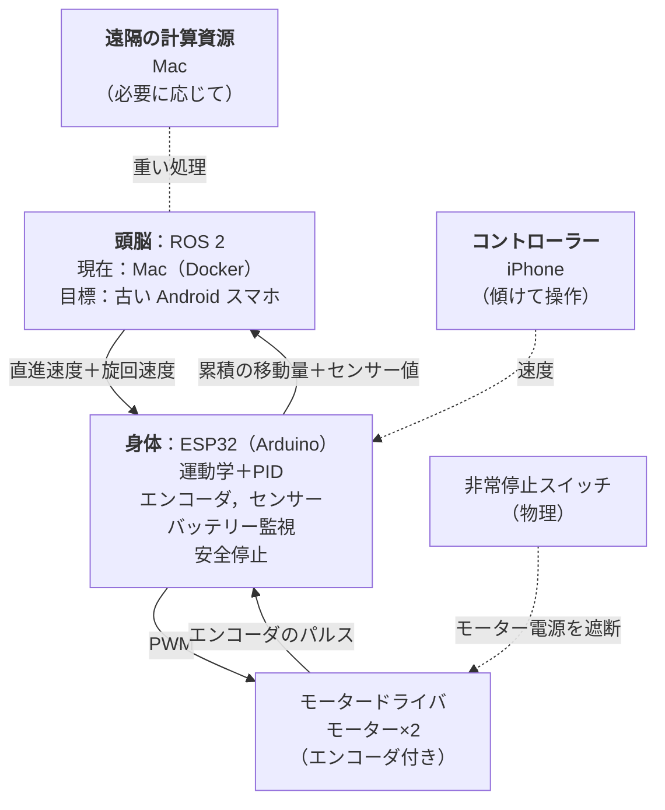

# esp32-ros2-rover

ESP32 の身体と差し替え可能な ROS 2 の頭脳を持つ低コストの差動二輪ロボット．段階的に育て，画像認識，SLAM，自動運転，自然言語でのやりとりを目指す．

[English](README.md)

> **現状：段階1に着手．** 構成と頭脳・身体間の約束事は決定済み．ファームウェアの制御ロジック（運動学，PID，指令タイムアウト）は実装済みで，PC 上の単体テストで確認している．ボード固有のコードは部品を決めてから書く．

## 特徴

- **頭脳と身体を分離．** ESP32 がリアルタイムのモーター制御と安全を担当し，単体でも走れる．頭脳は ROS 2 を動かし，それより上の処理をすべて担当する．
- **速度だけのインターフェース．** 頭脳は直進速度と旋回速度だけを送り（ROS の `/cmd_vel` 相当），身体は累積の移動量を返す．頭脳を Mac から古い Android スマホや Raspberry Pi に移しても，ファームウェアは変更不要．
- **通信路に依存しないプロトコル．** 同じテキストのメッセージが Wi-Fi（UDP）でも USB シリアルでも通る．
- **多層の安全対策．** 物理的な非常停止スイッチ，ESP32 のハードウェアウォッチドッグ，身体側の指令タイムアウト，頭脳側の通信監視，ESP32 単独での障害物停止．
- **低コスト．** ESP32 と既存の民生機器を再利用して組む．例えば古い Android スマホを頭脳に，iPhone をコントローラーに使う．
- **段階的に育てる．** シンプルなラジコンから始め，ROS 2，スマホの頭脳，認識，SLAM，LLM との対話を一歩ずつ加える．

## 構成

- **身体（ESP32）：** 速度を左右の車輪の速度に変換し，PID を回し，エンコーダとセンサーを読み，バッテリーを監視する．指令が途切れたらモーターを止める．
- **頭脳（ROS 2）：** 当面は Docker で ROS 2 を動かす Mac．目標は古い Android スマホ．重い処理は Mac に任せられる．
- **コントローラー（iPhone）：** 例えばスマホを傾けてロボットを操作する．
- **通信路：** まずは Wi-Fi（UDP）．スマホを車体に載せる段階では USB シリアルになる可能性がある．

同じ頭脳と身体の分担は [TurtleBot3](https://github.com/ROBOTIS-GIT/turtlebot3) や [OpenBot](https://github.com/isl-org/OpenBot) でも使われている．OpenBot と違い，このプロジェクトでは頭脳からモーターの PWM を送らない．そのため身体は単体で走れ，頭脳も差し替えられる．

詳細：[docs/architecture.md](docs/architecture.md)（英語）．

## ロードマップ

| 段階 | 目標 | 状況 |
| --- | --- | --- |
| 1 | **ESP32 単体のラジコン．** レーザーカットの車体，エンコーダ付きモーター2個．Mac から操作する． | **進行中** |
| 2 | **Mac の ROS 2．** ROS 2 から速度指令を送り，移動量を受け取る． | 予定 |
| 3 | **iPhone のコントローラー．** iPhone からロボットを操作する． | 予定 |
| 4 | **頭脳をスマホへ．** 頭脳を古い Android スマホに移す．研究的な段階で，詰まったら Mac のまま，または Raspberry Pi に差し替える． | 予定 |
| 5 | **発展．** カメラでの認識（まず色トラッキング，ニューラルネットは後），SLAM，LLM との会話． | 予定 |

**現在地：** 段階1．ハードウェアに依存しないファームウェアのロジックができた段階．次は部品の選定とメッセージ形式の決定．
未確定の設計事項は [docs/open-questions.md](docs/open-questions.md)（英語）で管理している．

## リポジトリ

| パス | 内容 |
| --- | --- |
| [`docs/architecture.md`](docs/architecture.md) | 決定済みの設計 |
| [`docs/open-questions.md`](docs/open-questions.md) | 必要になるまで決めない事項 |
| [`firmware/`](firmware) | ESP32 の身体（PlatformIO，Arduino）．中で `pio test -e native` を実行すると PC 上で単体テストが動く |
| [`AGENTS.md`](AGENTS.md) | AI コーディングエージェント向けの指示 |

ROS 2 パッケージとハードウェアのファイルは，それぞれの段階の開始時に追加する．

## ライセンス

[Apache License 2.0](LICENSE)

## AI の利用について

このプロジェクトは [Claude Code](https://claude.com/claude-code) などの AI コーディングアシスタントの助けを借りて開発している．設計の判断はメンテナーが行い，すべての変更はマージ前にメンテナーが確認する．
