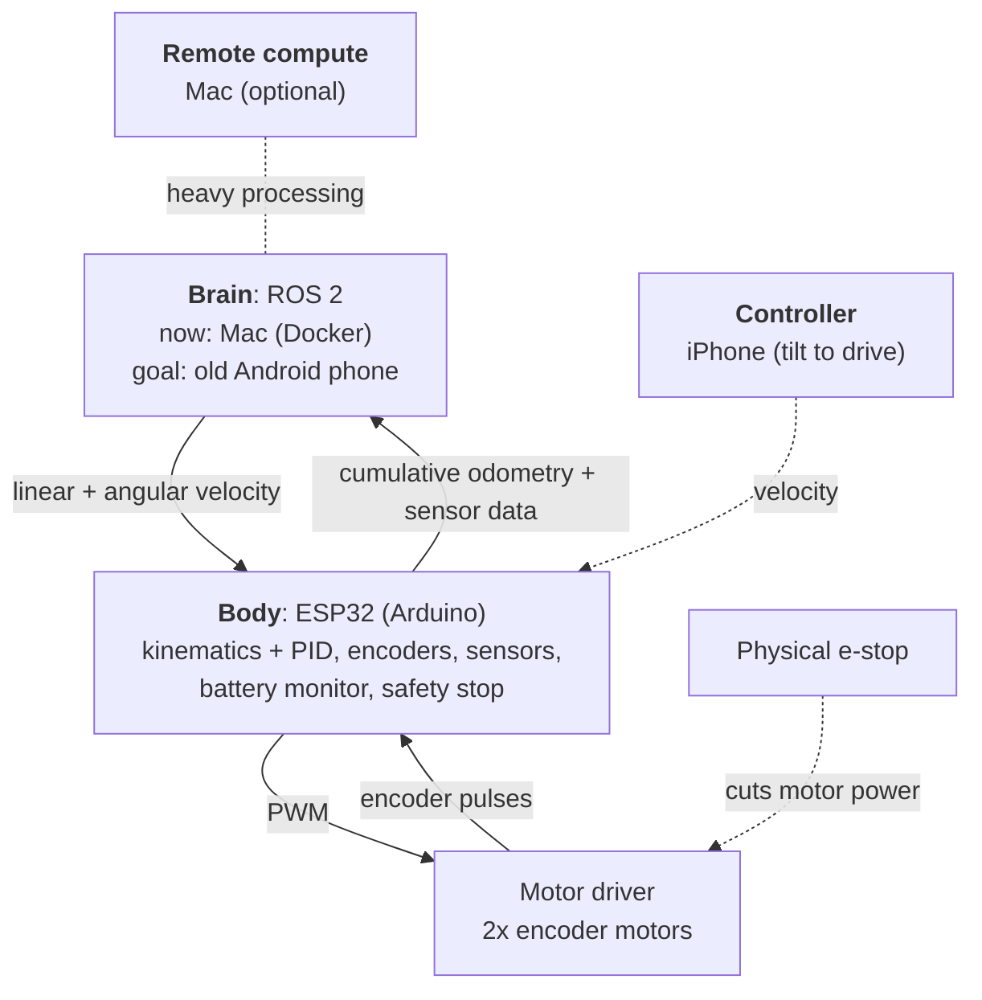

# esp32-ros2-rover

A low-cost differential-drive robot with an ESP32 body and a swappable ROS 2 brain, grown in stages toward vision, SLAM, autonomous driving and natural-language interaction.

[日本語](README.ja.md)

> **Status: Stage 1 in progress.** The architecture and the brain–body contract are defined. The firmware's control logic (kinematics, PID, command timeout) is written and unit-tested on the host; board-specific code comes once the parts are chosen.

## Features

- **Brain and body are separate.** An ESP32 handles real-time motor control and safety and can drive on its own. The brain runs ROS 2 and handles everything above that.
- **Velocity-only interface.** The brain sends only linear and angular velocity (like ROS `/cmd_vel`), and the body reports cumulative odometry. The brain can move from a Mac to an old Android phone or a Raspberry Pi without changing the firmware.
- **Transport-agnostic protocol.** The same text messages work over Wi-Fi (UDP) and USB serial.
- **Layered safety.** A physical e-stop, a hardware watchdog on the ESP32, a command timeout on the body, link monitoring on the brain, and obstacle stops handled locally on the ESP32.
- **Low cost.** Built around an ESP32 and reused consumer devices, such as an old Android phone as the brain and an iPhone as the controller.
- **Built in stages.** Start with a simple RC car, then add ROS 2, a phone brain, perception, SLAM and LLM interaction one step at a time.

## Architecture

- **Body (ESP32):** converts velocity into wheel speeds, runs PID, reads encoders and sensors, watches the battery, and stops the motors if commands stop arriving.
- **Brain (ROS 2):** a Mac running ROS 2 in Docker for now, with an old Android phone as the target. It can hand heavy work to the Mac.
- **Controller (iPhone):** drives the robot, for example by tilting the phone.
- **Link:** Wi-Fi (UDP) first; USB serial once a phone rides on the robot.

The same brain/body split is used by [TurtleBot3](https://github.com/ROBOTIS-GIT/turtlebot3) and [OpenBot](https://github.com/isl-org/OpenBot). Unlike OpenBot, the brain here never sends motor PWM, so the body can drive standalone and the brain stays replaceable.

Details: [docs/architecture.md](docs/architecture.md).

## Roadmap

| Stage | Goal | Status |
| --- | --- | --- |
| 1 | **ESP32-only RC car.** Laser-cut chassis, two motors with encoders, driven from a Mac. | **In progress** |
| 2 | **ROS 2 on the Mac.** Send velocity commands from ROS 2 and receive odometry. | Planned |
| 3 | **iPhone controller.** Drive the robot from an iPhone. | Planned |
| 4 | **Brain on a phone.** Move the brain to an old Android phone. Exploratory; the fallback is the Mac or a Raspberry Pi. | Planned |
| 5 | **Extensions.** Camera perception (color tracking first, neural networks later), SLAM, and conversation with an LLM. | Planned |

**Current position:** Stage 1 — hardware-independent firmware logic is done; choosing parts and defining the message format are next.
Open design questions are tracked in [docs/open-questions.md](docs/open-questions.md).

## Repository

| Path | Contents |
| --- | --- |
| [`docs/`](docs) | Settled design ([architecture](docs/architecture.md)) and [open questions](docs/open-questions.md) |
| [`drafts/`](drafts) | Sketches and early ideas |
| [`hardware/`](hardware) | CAD data and laser-cut files; later the parts list |
| [`software/`](software) | ESP32 firmware (PlatformIO, Arduino framework); later ROS 2 and tools |
| [`CONTRIBUTING.md`](CONTRIBUTING.md) | How to work on this repository as a team member |
| [`AGENTS.md`](AGENTS.md) | Instructions for AI coding agents |

Each folder has its own guide in English (`README.md`) and Japanese
(`README.ja.md`).

## License

[Apache License 2.0](LICENSE)

## Use of AI

This project is developed with the help of AI coding assistants such as
[Claude Code](https://claude.com/claude-code). Design decisions are made by
the maintainer, and every change is reviewed by the maintainer before it is
merged.
