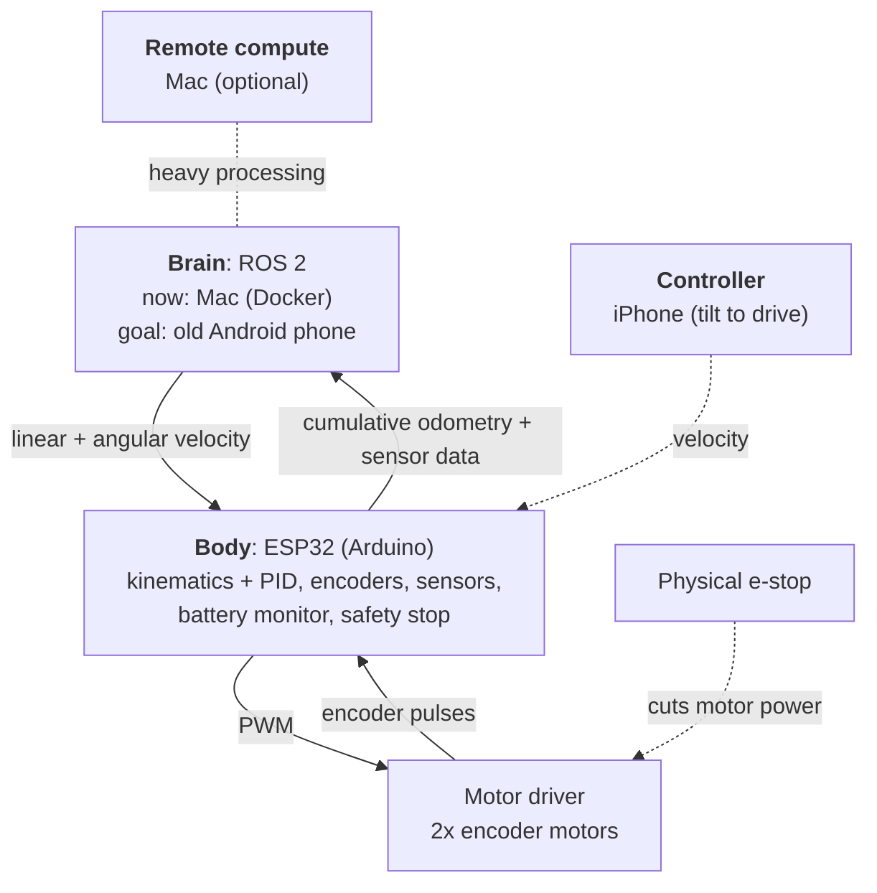

# Architecture

This document records the design decisions that are already settled.
Items that are still undecided live in [open-questions.md](open-questions.md).
Changes to anything here should be proposed with reasons first, not made silently.

## Goal

A low-cost, small differential-drive (two-wheel) mobile robot, grown in stages.
The long-term targets are ROS 2, camera-based perception with neural networks,
SLAM with LiDAR or similar sensors, autonomous driving, and natural-language
interaction through an LLM.

## Structure: separate the brain from the body

| Role | Device | Responsibilities |
| --- | --- | --- |
| Body | ESP32, programmed with the Arduino framework | Motor control (PID), encoders, sensors, battery monitoring, safety stop. Runs on its own without a brain. |
| Brain | For now a Mac running ROS 2 in Docker. The target is an old Android phone, which already has a camera, screen, IMU, Wi-Fi and enough compute for NN inference at low cost. The Mac may stay in the loop for heavy processing. | Everything above motor control: perception, mapping, planning, interaction. |
| Controller | iPhone | Remote control, for example tilting the phone to set the speed. An iPhone with LiDAR is also a candidate SLAM sensor. |
| Development | Mac | Editing, building and flashing the ESP32. The brain is reached over SSH (for example VS Code Remote-SSH). |

Reference designs with the same split:

- **TurtleBot3**: Raspberry Pi (brain) + OpenCR microcontroller board (body).
- **OpenBot**: smartphone (brain) + Arduino Nano or ESP32 (body).

## Brain–body contract

This is the most important rule in the project.

**Brain → body: velocity only.**
The brain sends a linear velocity and an angular velocity, equivalent to a ROS
`/cmd_vel` message. It never sends PWM values or per-motor commands.
Converting velocity to left and right wheel speeds, and running PID on each
wheel, is the body's job.

**Body → brain: motion and sensor data.**
The body reports how far it has moved (encoder counts or equivalent) and its
sensor readings. Motion is reported as **cumulative totals, not deltas**, so
that if one UDP packet is lost, the next one fully recovers the state.

**Command timeout.**
If no command arrives for a set time (for example 0.3 s), the body stops the
motors on its own.

**Transport independence.**
The message format does not depend on the link. While the brain is a Mac the
link is Wi-Fi (UDP); once a phone rides on the robot it may become USB serial,
as in OpenBot. The same text message must work unchanged over either link.
The exact message syntax will be defined when Stage 1 begins.

**Why.**
As long as this contract holds, the brain can be swapped between a Mac, a
phone, a Raspberry Pi or anything else without changing the ESP32 firmware.

**Difference from OpenBot.**
OpenBot's phone sends left and right motor PWM values directly. This project
deliberately sends only velocity, so that the body can drive on its own, an
iPhone can drive it directly, and the brain can be replaced.

## Safety: when a layer fails, the layer below stops the robot

| Failure | What stops the robot |
| --- | --- |
| Any failure (last resort) | A physical emergency-stop switch that cuts motor power. This is the lowest layer. |
| The ESP32 itself hangs | The PWM peripheral keeps driving the motors even if the program is stuck, so a hardware watchdog resets the chip. |
| The brain or the link goes down | The ESP32 detects that commands have stopped arriving and stops the motors. |
| Remote processing (for example on the Mac) goes down | The brain detects the loss and stops the robot. |

Motor driver inputs must default to stopped while the ESP32 resets or boots.
During that time its pins float and some pins may output signals, so wire the
inputs with pull-down resistors or similar; otherwise a watchdog reset could
leave the motors running.

Fast reactions such as stopping just before an obstacle are handled by the
ESP32 alone, so they do not depend on network latency.

## Communication

- Start with a simple, self-made, text-based protocol. Wi-Fi (UDP) is the
  first choice.
- Bandwidth is not a concern. Camera video never passes through the ESP32.
- The usual bottlenecks are not the link itself but:
  - the main loop being blocked by `delay()` or `pulseIn()`,
  - missed encoder counts,
  - I2C wiring problems.
- Many managed Wi-Fi networks (offices, campuses, hotels) block traffic
  between client devices. Use a dedicated network for the robot, such as a
  phone hotspot.
- Most ESP32 modules support 2.4 GHz Wi-Fi only.

## Power

- Motors run on a separate power branch, so that voltage drops from the
  motors do not reset the microcontroller or drop the link.
- A single battery is fine if it is split into a motor branch and a logic
  branch (a step-down DC-DC converter for the ESP32 and the phone).
- All branches share a common ground.

## ESP32 firmware rules

- Never use `delay()`. Run periodic work on a fixed schedule with `millis()`.
- Read serial and UDP input only as far as data has arrived; never block the
  loop waiting for more.
- Stop the motors when commands stop arriving.
- Read encoders with interrupts or a hardware pulse counter.
- Keep Wi-Fi passwords and other secrets in `secrets.h`, which is ignored by
  Git. Commit only `secrets.example.h`.

## Staged plan

1. **ESP32-only RC car.** Laser-cut chassis, two motors with encoders, driven
   from the Mac.
2. **ROS 2 on the Mac.** Send velocity commands from ROS 2 and receive motion
   data back.
3. **iPhone controller.** Drive the robot from an iPhone.
4. **Brain on a phone.** Move the brain to an old Android phone. Running ROS 2
   on Android is not a well-trodden path (OpenBot itself uses its own app, not
   ROS), so this stage is exploratory. If it stalls, keep the Mac as the brain
   or switch to a Raspberry Pi. Thanks to the contract, the body does not
   change either way.
5. **Extensions.** Camera perception (simple color tracking first, neural
   networks later), SLAM, and conversation with an LLM (a cloud API is the
   realistic option).

## References

- [OpenBot](https://github.com/isl-org/OpenBot): a smartphone as the brain and
  an Arduino Nano or ESP32 as the body. Includes a controller app that drives
  the robot by tilting a phone.
- [TurtleBot3](https://github.com/ROBOTIS-GIT/turtlebot3): the standard
  Raspberry Pi + microcontroller ROS 2 robot.
- Articulated Robotics (YouTube): a video series on building a ROS 2 robot with
  a Raspberry Pi and an Arduino. Its split of work over a serial link is a
  useful reference.
